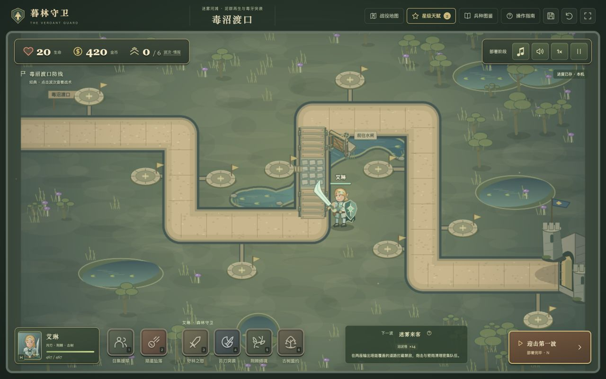

# 暮林守卫 · The Verdant Guard

[在线试玩](http://106.12.6.24:5173/) · [GitHub 源码](https://github.com/zhaoyul/kindom_rush_like)

一款原创的浏览器塔防小游戏，采用固定道路、建塔位、近战拦截、英雄指挥与主动技能的玩法。当前包含森林、毒沼、霜峰与熔火四关战役，共 29 波、931 名敌人；每关有独立路线、10 个建塔位与可恢复的本机进度。四种防御塔、12 种敌军和英雄/驻兵/援军相互配合，可选择三级塔的互斥流派、调整火力优先级、抢先放波、分配永久星级天赋，并挑战三档难度。首领重击具有可躲避、可打断的预警；艾琳可以启动毒沼水闸，通关后可挑战「四塔防线」「禁咒试炼」，战后复盘展示防线贡献与危险波次。

技术栈为 **TypeScript + Vite + Canvas 2D**。场景与关节角色由 Canvas / SVG 绘制，背景音乐和战斗音效由 Web Audio 合成。单位英语台词由小米 MiMo 预生成并打包为 MP3，保留中文界面与双语字幕；浏览器直接播放静态文件，游戏运行时无需后端或在线语音服务。



## 运行与验证

需要 Node.js 20.19+（20.x）或 22.12+，以及 npm。

```sh
git clone https://github.com/zhaoyul/kindom_rush_like.git
cd kindom_rush_like
npm ci
npm run dev
```

打开 <http://localhost:5173>。端口被占用时，以终端实际输出的地址为准。

```sh
npm test           # 战斗规则、完整战役、音频事件与播放生命周期
npm run typecheck  # TypeScript 类型检查
npm run build      # 类型检查并生成 dist/
npm run preview    # 本地预览生产构建
```

本批完整 `npm test` 已实际通过 **192 / 192 项测试，0 失败、0 跳过**；`npm run build` 的 TypeScript 检查与 Vite 生产构建均通过。覆盖沼泽水闸的条件/范围/续战、两规则挑战及独立成绩/存档、战斗贡献归因与部分复盘、新旧规则兼容，以及四关战斗、8 种三级流派、首领反制、目标策略、提前放波、难度/天赋、音频和存档边界。

水闸地形重绘后已再次运行以上 192 项测试和生产构建，均通过。浏览器实测待机与开闸：水流沿蓄水湾、闸口、漫水渡道和排水池下泄，活动时显示 6 秒计时。390px 视口下页面宽度与滚动宽度均为 390px，手轮点击区为 24px，状态文字完整可见。预览：[重绘后的水闸区域](docs/previews/marsh-waterway-redesign.png)、[沿河道泄洪](docs/previews/marsh-waterway-flood.png)、[390px 地形与操作](docs/previews/marsh-waterway-mobile.png)。

正常金币实战模拟通过老兵森林无永久天赋、英雄森林与熔火使用合法 12 星配置的全敌军击杀路线；每 2 秒才进行一次技能决策，每波最多成功施放森林 3 次、熔火 6 次。每 5 秒导出存档、导入新引擎并逐帧比较，部署难度、天赋和后续战斗均一致。森林另验证三塔不使用主动技能、六塔分散布置付费流派，以及中段仅 3 次荆棘干预的满生命通关；4 项 `forest-pressure` 测试核对原波次哈希、每波敌种/人数/赏金不变及压力变化。所有模拟仅使用正常开局、击杀、补给与早波奖金，核对原敌群和每波补给只发一次。

音频与语音相关 25 项测试通过，覆盖齐射去重、连锁命中时序、持续领域的单次声音、炮弹到达爆炸时序、首领重击与打断音效、水闸开闸/流水时序和暂停去重、图鉴暂停试听和真实 MP3 资产。42 段英语人声均已用 ffprobe / ffmpeg 解码验证：每句 1.84–3.77 秒，总计约 138.55 秒，资源总大小 856,946 字节；均为有效非静音音频，最大解码峰值为 0.75952，无削波。全部 42 段经过 MiMo ASR 逐句复核，忽略标点、大小写、数字和控制标签后与最终英文字幕一致；已重录修复重复句、异常长停顿和词语误读。精兵第二句实际发音为「the shield」，字幕已同步，manifest 保留原生成请求中的「this shield」供核对。

本批浏览器实际验证四塔满额提示、出售后重建，禁咒技能按钮禁用及快捷键 `2` 拒绝施放；刷新后禁咒玩法仍保留且默认暂停。另一份四塔续战独立恢复为 4 座塔、16 金币。390px 视口下，挑战对话框宽 352px、内容宽与滚动宽均为 310px，没有水平溢出。

新版沼泽实战在第 2 波开闸一次，保存刷新保持洪流剩余状态，继续后转为冷却，开闸/流水声音未重复。完整守完 6 波，未提前召敌，以 **16 生命、158 / 162 击杀、1739 剩余金币、2 战役星**获胜。4 名沼泥怪在第 2 波突破，实际扣除 4 生命；复盘对应最危险第 2 波、峰值 19 名敌人、最远推进 100% 和损失 4 生命。

战后实际伤害总账为 **30177**、贡献击杀 **158**。5 个历史塔条目的「伤害 / 击杀」依次为 `11285 / 59`、`7212 / 52`、`6784 / 31`、`4283 / 13`、`613 / 3`，逐条相加与总账一致；建造点 5 的旧魔法塔保持出售标记，原处重建的新塔独立记账。刷新后复盘数值、出售记录及水闸启动 1 次全部保留。390px 复盘内容宽与滚动宽均为 310px，总览指标为两列各 151px、贡献与漏怪区为单列，没有水平溢出；浏览器控制台没有 error 或 warn。

本批预览：[桌面规则挑战](docs/previews/rule-challenges-desktop.png)、[390px 挑战选择](docs/previews/rule-challenges-mobile.png)、[沼泽洪流活动](docs/previews/marsh-floodgate-active.png)、[桌面战后复盘](docs/previews/marsh-battle-report-desktop.png)、[各塔贡献与出售记录](docs/previews/marsh-battle-report-towers.png)、[390px 战后复盘](docs/previews/marsh-battle-report-mobile.png)。

更早的浏览器记录已验证塔等级/专精/目标优先级及训练配置刷新恢复、续战默认暂停、选择新难度后经典续战仍保留原难度、双语人声试听和 390px 六技能栏。原森林第 6 波早放保留 5 名旧敌并加入 23 名新敌，金币 488→563（补给 50、奖金 25）；全关以 20 生命、168 击杀获得 3 星。三项训练各学 1 阶后可用星归 0，免费重配返还 3 星且最高星级和毒沼解锁保留，重学刷新仍在；老兵毒沼新部署显示英雄 467/467 生命（实际 466.4），援军/陨星/守林之怒冷却 23s/30.7s/28.8s，刷新后仍是老兵、420 金币、第 0 波及原训练。

流派更新时，浏览器从森林正常 360 金币开局，以实际击杀收益购买流派与专精：第 4 波间歇先以 150 金币选择蜂巢火炮，再学习震地冲击 I（90 金币）并转型破城重炮（75 金币）；后两项支出使金币由 379 变为 214，震地 I 保留，出售预览为 553。再以 185 金币将魔法塔升至三级，手动保存并刷新后，第 4 波、29 金币、破城重炮、震地 I 与 553 出售返还全部恢复。

第 5 波后持有 487 金币，将一级兵营升至二级（100）、三级（155），学习铁壁军阵 I（90）并选择古树盾卫（130），准确剩余 12 金币。驻兵界面显示 445 最大生命、22 攻击、63% 护甲，与 `390 + 55` 生命和 `55% + 8%` 护甲一致；三级魔法塔、炮塔流派和震地专精也都保留。移动菜单已实测在 390px 视口无水平溢出，260px 宽卡片中的流派选项保持整行，459px 内容可纵向滚动。

流派更新实测继续守完新版森林 8 波，最终 20 生命、168 击杀、2069 金币；途中实际显示荆棘酋长 1609/2200 生命与收招提示。界面正常结算并保留已解锁毒沼；浏览器控制台无 error 或 warn。首领固定落点、主动打断和蓄力存档恢复另由 12 项 Boss 专项自动测试验证。

流派预览：[桌面流派转型与费用](docs/previews/tower-branches-desktop.png)、[390px 移动菜单](docs/previews/tower-branches-mobile.png)、[新版森林实战通关](docs/previews/new-forest-victory.png)。更早的预览：[火力策略与抢先召敌](docs/previews/tactics-battle-preview.jpg)、[波次情报与兵种克制](docs/previews/wave-intel-preview.jpg)、[难度选择](docs/previews/playability-preview.jpg)、[实际通关后的星级训练](docs/previews/training-preview.jpg)、[精细英雄与三级炮塔](docs/previews/hero-cannon-voices-preview.jpg)、[炮塔就地专精与英文字幕](docs/previews/expanded-game-preview.jpg)、[四关战役地图](docs/previews/campaign-map-preview.jpg)。[23 秒多角色英文试听](docs/previews/mimo-voice-preview.mp3)依次包含艾琳、禁卫、法师、炮手、哥布林和熔铠领主。

## GPU 服务器部署

已通过本机 SSH 配置中的 `gpu` 部署到 `/mnt/kindom_rush_like`，公网访问地址为 <http://106.12.6.24:5173/>。生产文件位于 `releases/20261006T052809Z/`，`current` 链接指向该版本；使用独立 Nginx 实例和 `verdant-guard.service`，已启用开机启动及异常退出自动重启。

```sh
ssh gpu 'systemctl status verdant-guard.service --no-pager'
ssh gpu 'systemctl restart verdant-guard.service'
ssh gpu 'journalctl -u verdant-guard.service -n 50 --no-pager'
```

Nginx 配置和 systemd 单元的本地副本位于 `deploy/gpu/`，服务器配置为 `/mnt/kindom_rush_like/nginx.conf`，访问和错误日志在 `/mnt/kindom_rush_like/logs/`。后续更新先构建完整 `dist/`，上传到新的 `releases/` 子目录并校验，再原子切换 `current`；不要把源码、SSH 文件或 `node_modules` 放进站点根目录。健康检查为 `/healthz`。

此次部署已核对公网返回的全部 **47 个文件**与本机 SHA256 一致，其中 **42 段 MP3**，并验证语音字节范围请求返回 `206`、缺失资源返回 `404`。详情见 [部署校验记录](docs/previews/gpu-deployment-verification.json)。公网地址与 localhost 的浏览器存档分别保存，原本机进度不会自动转移。

## 四关战役与存档

| 关卡 | 波数 / 敌人数 | 开局金币 | 战术特点 |
| --- | --- | ---: | --- |
| 暮林隘口 | 8 / 168 | 360 | 原始森林防线，混合轻甲、疾奔狼、萨满与荆棘酋长 |
| 毒沼渡口 | 6 / 162 | 420 | 泥怪移动再生与毒蛇持续中毒，炮击清群，英雄开闸制造减速洪流 |
| 霜峰古道 | 7 / 221 | 470 | 霜狼抵抗减速、霜铠卫厚甲，拦截与魔法/穿甲互补 |
| 熔火王座 | 8 / 380 | 520 | 小鬼阵亡自爆、混合重甲军团与范围锤击的熔铠领主 |

新版森林保留前两波教学、每波原有敌种与数量，以及全关 168 名敌人和相同总赏金；第 3–8 波重新安排重甲、治疗护送和快敌的到达时机，第 6 波及末波的狼群分为两批。对相同正常金币、三塔、无主动技能路线的比较中，新旧规则均以 20 生命、168 击杀通关，结束时同为 2084 金币。后段敌人推进更深，末波同时承受的敌群更密集：

| 相同路线的压力指标 | 旧规则 | 新规则 |
| --- | ---: | ---: |
| 第 6 波最大道路推进距离 | 786 | 953 |
| 第 7 波最大道路推进距离 | 949 | 1191 |
| 末波场上敌人数量峰值 | 16 | 23 |
| 末波场上敌军当前生命总和峰值 | 5233 | 6379 |

推进距离以战场道路坐标计，生命峰值为当时仍在场敌军的当前生命总和。这组比较展示同一路线下的护送与分批压力变化；正常经济路线仍能守住。中段移动英雄并全关仅施放 3 次荆棘缚境，使第 7 波最大推进从 1191 降至 870、末波从 974 降至 852，以 20 生命、168 击杀、291 秒和 2084 剩余金币通关。另一条分散六塔路线购买 5 个三级流派，全关不使用主动技能，也以 20 生命、168 击杀、334 秒和 834 剩余金币通关。两条路线使用真实开局与击杀经济，展示英雄干预和更广火力覆盖的不同应对方式。

首次仅开放暮林隘口，通关依次解锁下一关。战役地图显示各关最高星级及老兵、英雄挑战徽章，可重打提升成绩；重打不会抹去已取得的最高星级。各难度共同使用每关最多 3 星的最高成绩，四关共最多获得 12 星，高难度徽章不重复发放星星。每关分别保存当前波次、金币、建筑等级、流派与专精、累计转型投入、目标优先级、单位生命、集结地、技能冷却、控制/增益剩余时间，以及该局难度、规则版本、部署时的天赋配置和首领蓄力进度。

自动存档每 5 秒更新，顶部存档按钮可立即保存；波次推进、技能与水闸操作、切关等关键操作也会保存，页面隐藏、离开或关闭时会尝试保存。刷新或从战役地图继续进行中的战斗时默认暂停，点击继续后才推进时间。存档同时保存当前玩法、水闸活动/冷却/累计启动次数和战斗复盘；各关的标准战役、四塔防线与禁咒试炼分别拥有一个续战位，续战保留该局难度和部署天赋。存档保存在当前浏览器的 `localStorage`（键为 `verdant-campaign-v1`），清除站点数据会清除战役进度；存储失败时界面会提示，战斗仍可继续。

旧版本的森林最高星级（`verdant-best`）首次升级时自动迁入战役记录，并解锁毒沼；不会虚构旧版未记录的剩余生命。

新部署使用 `rulesVersion: 2`。没有此字段的旧战斗存档按版本 1 恢复，森林继续使用原版波次安排，两个首领保留原来的普通攻击规则，不会在续战途中突然加入预警重击；已有难度、天赋、建筑、技能与剩余计时照原值恢复。只有缺失难度或天赋字段的更早存档才分别默认经典和无加成。旧三级塔没有流派时继续使用原属性，不会自动转型；重新部署才进入新版森林与首领规则。存档外层格式及战役存储键仍为原版本，导入会校验流派所属塔类、转型累计成本及首领预警/计时的一致性，坏档不会部分覆盖当前战斗。

## 战术、天赋与挑战

箭塔、魔法塔和炮塔的就地菜单增加三种火力策略：**出口**优先攻击最接近出口的敌人，**强敌**优先攻击当前生命最多的敌人，**残血**优先攻击当前生命最少的敌人。生命排序使用当前值，生命相同时再看距出口的进度；每座塔独立设置，升级、保存与续战均保留。驻兵仍按近战拦截规则作战。

当前波全部敌人已经进场、仍有活敌且还有下一波时，可点击「抢先召敌」或按 `N`。旧敌继续行进和战斗，新波按原计划加入，必须清理全部敌人才能结束战斗。提前放波发放当前波原补给 `25 + 5 × 波号`，并增加最多 **25 金币**的冒险奖金；奖金依据余敌按基础移速走到出口所需的最长时间计算为 `min(25, floor(剩余秒数 × 0.5))`，拦截、定身或减速不会抬高奖金。全部六个主动技能的当前冷却减少 **4 秒**，最低降至 0。每波原补给仍只领取一次，重叠敌群不会重复发钱。

四类塔达到三级后，可在就地菜单的「终极流派」页选择两个互斥分支之一，也可以保留普通三级塔。已选择流派后可付费转为同类的另一分支，转型价格为首次选择价格的一半（向上取整）；已学的三种专精、等级、独立计时器、火力优先级和集结地均保留。「进阶专精」另设分页，流派不占用专精名额。所有历次选择与转型支出均计入总投入，出售统一返还总投入的 70%（向下取整）。驻兵转型保持当前生命比例，阵亡者继续等待原补员计时，不会借转型满血或复活。

下表为无永久天赋、无专精增益的基础流派属性，金币仅为达到三级后的流派费用，未含建造和升级投入；远程伤害仍受对应敌人抗性减免。

| 防御塔 / 流派 | 首次 / 后续转型金币 | 单次攻击 / 间隔 | 射程 / 集结范围 | 被动与取舍 |
| --- | ---: | --- | ---: | --- |
| 箭塔 · 密林游侠 | 120 / 60 | 38 物理 / 0.32s | 190 | 快速连射，短射程清理轻甲队伍 |
| 箭塔 · 月鹰狙手 | 120 / 60 | 105 物理 / 1.35s | 255 | 高单发、远射程，牺牲射速 |
| 魔法塔 · 星界秘法师 | 140 / 70 | 155 魔法 / 1.05s | 210 | 普通命中减速 25%，持续 0.9s |
| 魔法塔 · 极霜咒术师 | 140 / 70 | 85 魔法 / 1.10s | 225 | 普通命中减速 55%，持续 2.1s |
| 炮塔 · 蜂巢火炮 | 150 / 75 | 76 物理 / 1.75s | 185 | 爆炸半径 105，以伤害和射程换范围 |
| 炮塔 · 破城重炮 | 150 / 75 | 132 物理 / 1.90s | 255 | 爆炸半径 44，命中削弱护甲 18、魔抗 12 个百分点，持续 3s |
| 驻兵塔 · 古树盾卫 | 130 / 65 | 每名驻兵 22 物理 / 1.00s | 210 | 每名驻兵 390 生命、55% 护甲，高防御、低输出 |
| 驻兵塔 · 逐风剑卫 | 130 / 65 | 每名驻兵 49 物理 / 0.64s | 210 | 每名驻兵 230 生命、28% 护甲，快攻、较脆弱 |

流派基础属性继续使用本局部署天赋。驻兵实际最大生命为 `流派基础生命 × 驻兵天赋倍率 + 铁壁军阵阶数 × 55`，护甲再加铁壁军阵每阶的 8 个百分点；流派面板和塔属性显示计入本局天赋、已学专精后的数值，并标明减速或破甲等被动。

顶部「星级天赋」使用已获得的最高星级训练守军。四项天赋各有 **3 阶，每阶消耗 1 星**，效果按阶数相加：

| 天赋 | 每阶效果 | 3 阶效果 |
| --- | --- | --- |
| 精准射击 | 箭塔、魔法塔、炮塔攻击伤害 +4% | +12% |
| 坚实防线 | 兵营驻兵基础最大生命 +6% | +18% |
| 守林之心 | 英雄最大生命 +6% | +18% |
| 专注施法 | 援军、陨星及全部英雄主动技能冷却 −4% | −12% |

可以免费重置并重新分配全部已用星星，星级、关卡解锁和各关续战保留。训练只在开始新关或重新部署时生效；进行中的战斗及继续旧存档使用其原配置，重置不会改变已有单位生命或再次叠加加成。旧战役星级可直接用于训练，未记录难度与天赋的早期战斗存档默认经典难度且无永久加成；非法阶数、超支分配和未解锁关卡的坏记录不能提供额外天赋。

战役地图为新部署提供三档难度：

| 难度 | 敌军生命倍率 | 敌军伤害倍率 |
| --- | ---: | ---: |
| 经典 | ×1.00 | ×1.00 |
| 老兵 | ×1.25 | ×1.12 |
| 英雄 | ×1.50 | ×1.20 |

敌军伤害倍率同时影响近战、中毒、自爆和首领范围攻击。波次人数、速度、抗性、击杀收益、开局金币和原补给保持相同；难度选择仅影响新部署，继续存档沿用该局难度。老兵与英雄分别记录本关最高 1–3 星挑战徽章；重打只在提升该关共同最高星级时增加可用星星，刷新恢复已胜利的战斗不会重复计奖。

新版规则中的荆棘酋长与熔铠领主会先锁定最近友军当时的位置，再原地蓄力发动范围重击。红色预警圈固定在已锁定的坐标，不会追随目标移动；蓄力结束时，只伤害仍在圈内的活友军。顶部首领 HUD 显示生命、蓄力倒计时、收招与打断提示，首领姿态及地面圈也对应前摇、落击和收招。

| 首领 | 蓄力时间 | 重击半径 | 基础物理伤害 | 完成后冷却 / 收招 |
| --- | ---: | ---: | ---: | --- |
| 荆棘酋长 | 1.8s | 82 | 112 | 10s / 0.8s |
| 熔铠领主 | 2.1s | 92 | 148 | 12s / 1.0s |

移动英雄或调整驻兵集结地离开红圈可以躲避；在前摇期间用月刃突袭命中首领，或用荆棘缚境覆盖首领，可以打断重击并移除待结算预警。普通减速、毒藤箭与冰霜领域不能打断。打断后首领收招 0.6s，重击冷却为正常值的 60%；首领在蓄力期间被击杀也会取消重击。伤害乘以本局难度倍率，再按友军护甲及古树盟约的护甲加成减免；保存、暂停和续战保留预警位置、剩余前摇、冷却及收招时间。

点击波次预告可查看战术情报。敌人数、总击杀金币、预计出兵时长、敌群密度及重甲/快敌/治疗者/首领标签直接从当前波次与兵种属性推导，显式延迟和重叠出兵也计入。界面给出塔型、目标优先级、技能及道路布防建议，图鉴也显示对应克制：魔法对付重甲，物理与真实伤害应对魔抗，驻兵和定身拦快敌，炮击清密集队伍，治疗维持中毒后的防线，分散英雄与驻兵应对自爆和范围锤击。情报中的敌军生命随当前战斗难度显示。

## 水闸、规则挑战与战后复盘

新版毒沼渡口的关口岸边设有「沼泽水闸」。点击旁边的「前往水闸」可让艾琳靠近，也可以用英雄移动指令自行部署；英雄存活、距机关不超过 **100**、正在战斗、冷却完成且洪流区域内有敌人时，按钮变为「开启水闸」。启动后以关口为中心、半径 **130** 的区域持续 **6 秒**，区域内包括随后进入的敌人减速 **55%**；从启动时开始冷却 **35 秒**。洪流只降低移速，普通控制无法打断首领重击，水闸也不造成伤害。

水闸区域由东北蓄水湾、岸边闸门、低矮石木渡道和西南排水池组成，河岸保留芦苇、湿石与连接塔位的短步道。闸板沿木导柱升降，泡沫与泥水沿真实河道下泄、经过渡道后散入池塘；水流裁剪到河道轮廓。操作贴合实体手轮，旁边显示活动或冷却倒计时；半径 130 的细虚线范围只在悬停或聚焦手轮时预览。道路路线、塔位、英雄靠近条件和减速范围保持兼容。

开闸机械声和短流水声各播放一次，不持续循环噪声。暂停与续战保留剩余持续及冷却时间，关卡结束时停止洪流。水闸仅用于 `rulesVersion: 2` 的毒沼关；旧规则续战不会中途加入机关。已有新版毒沼存档若缺少 `mapEvent`，恢复时补为未启动的待机状态，历史洪流、冷却或启动次数不补造。

在标准战役通关某关后，该关开放两种规则挑战。进入「战役地图」，先选择「玩法规则」，再选择关卡与难度；各玩法的波次、开局经济及永久天赋仍采用本关部署规则。

| 玩法 | 限制与可用能力 | 成绩与续战 |
| --- | --- | --- |
| 标准战役 | 正常建塔与六个主动技能 | 提升战役星级、解锁后续关卡；每关一个续战位 |
| 四塔防线 | 同时最多 **4 座**防御塔；出售后可换位重建，升级、流派、专精、英雄及全部技能照常可用 | 每关独立续战；经典、老兵、英雄分别记录最高徽章、最佳剩余生命与通关次数 |
| 禁咒试炼 | 禁用**陨星坠落**，技能按钮与快捷键 `2` 都受限制；援军、英雄四招和塔能力照常可用 | 每关独立续战；经典、老兵、英雄分别记录最高徽章、最佳剩余生命与通关次数 |

规则挑战按剩余生命授予 **1–3 级徽章**，与标准战役星级分开记录，不额外提供天赋星星，也不会覆盖标准续战或重复解锁关卡。切换关卡、选择另一玩法或刷新后继续，均恢复相应续战位保存的原难度与天赋；重新部署才采用界面当前选择。

胜利或失败后点击「查看战斗复盘」，可以查看本局模拟时间、实际伤害与贡献击杀，各塔及其驻兵/专精的伤害和击杀，艾琳伤害、击杀、阵亡与成功打断首领次数，驻兵阵亡、水闸启动，以及突破防线的敌种、数量与生命损失。出售的塔保留记录，同一座塔转型前后的贡献合并；援军与陨星单独归入支援贡献。伤害按敌人实际生命下降计算，过量伤害不计入。

复盘还标出最危险交战时段：优先比较生命损失，再比较最远道路推进，最后比较同时在场的敌人峰值。提前召敌后的交战时段包含上一波余敌，界面给出峰值人数、道路推进百分比与损失，便于调整下一局的火力策略和集结点。

新部署从开局完整记录，复盘随存档续写。旧战斗存档缺少 `report` 时会建立 **`partial: true` 部分记录**，界面明确显示从该次恢复时刻开始统计；续战前的塔伤害、漏怪或英雄贡献不会根据历史总数推算补齐。已有塔标记为恢复时已存在，其后出售、升级与转型继续记录；旧存档原有战斗总伤害、击杀和剩余生命仍按原值恢复。

## 已完成的机制

- 每关开局 20 生命，金币按关卡为 360 / 420 / 470 / 520。击杀提供金币，第 n 波的固定补给为 `25 + 5 × n` 金币，正常清场或提前接入下一波时领取一次；漏怪按敌人种类扣生命。
- 箭塔、魔法塔、炮塔、驻兵塔均有 3 级，可战斗中建造、升级，出售返还总投入的 70%（向下取整）。
- 每座三级塔有 2 个互斥流派可选，可付费转型；仍可分别学习 3 项专精，每项有 2 个等级，学习后自动生效。范围杀伤、随机暴击、减速和兵营防御/治疗可同时组合；出售返还包含专精及历次转型投入。
- 驻兵塔派出 3 名士兵；选中兵营可通过就地菜单里的集结旗帜或 `R` 设置集结地，高亮道路表示可部署范围。每座兵营独立保存集结地，升级与补员后仍会驻守那里。每名士兵或英雄拦截一名敌人；士兵阵亡 9 秒后补充。
- 四类塔的每个等级及 8 种三级流派拥有对应建筑外观，箭塔弓手与魔法晶体会随攻击动作发射，炮塔具有炮管后坐与抛物线炮弹。
- 英雄、驻兵和各类敌人具有朝向、蓄力、挥击、收招和受击动作；艾琳增加分层披风、编辫、甲片刻纹、面部、护腿、叶纹盾与月刃细节，关节动作沿用交替连斩与冲步，技能使用范围剑弧和符文。
- 英雄艾琳以守林者身份拥有 4 招：近身反击与自疗、月刃穿阵、荆棘定身和古树护军。她可移动、自动近战拦截，阵亡 15 秒后复活。波间英雄和士兵恢复生命。
- 六个主动技能独立冷却：援军、陨星与艾琳的 4 个技能。陨星、守林之怒和月刃突袭造成真实伤害，荆棘缚境造成魔法伤害；援军持续 24 秒，阵亡后不复活。
- 萨满每 3 秒为周围受伤敌人恢复 18 生命；普通魔法塔命中减速 35%，两种魔法流派另有控制强度与持续时间。物理伤害受护甲减免，魔法伤害受魔抗减免。
- 战场占据主界面；点击石基即可在附近选择四种塔，点击建筑即可就地升级、集结或出售。英雄与技能位于战场底部，生命、金币、波次和播放控制位于上方。
- 原创 16 小节森林主题音乐包含长笛、竖琴、弦乐、贝斯与打击乐，循环播放。第一次点击或按键解锁浏览器音频；音符按钮与扬声器分别控制背景音乐和战斗音效。暂停或隐藏页面时音乐停止，恢复后沿原进度继续。
- 箭塔、魔法塔、英雄、士兵及各类敌人的攻击有独立发射、挥击和打击声音；打击声随箭弹到达、剑刃挥击和技能动画的进度播放。
- 高级技能有独立音色：箭雨齐射、重弦狙杀、藤蔓缠绕、电弧连跳、奥术爆裂、冰晶展开、旋风斩与林地祝福；英雄的月刃风啸、根须震动、古树和弦跟随各自特效播放。持续领域只在展开时发声一次。
- 炮弹出膛、普通爆炸、穿甲重弹、集束爆炸与震地低频有独立声音，炮击爆炸声随炮弹可见落点播放。
- 21 类单位各有两句独特英语点击回应，共 42 段人声：英雄、三阶驻兵、援军、12 种敌军与四种塔操作员。人类使用 Mia / Chloe / Milo / Dean 四种英文声线和各自表演风格，12 种敌军分别设计声线，第二句以本角色第一句为参考克隆。点击时显示英文与中文翻译，图鉴可暂停试听；同单位快速重复点击节流、切换单位打断前句，音乐在台词期间降低音量。人声复用战斗音效开关，暂停/隐藏/切关会取消播放和未完成的加载；资源失败显示明确提示。
- 支持暂停、1× / 2× 速度、全屏、敌人属性查看、下一波预告与重新开始。打开手册/图鉴会暂停；切出页面时战斗自动暂停。
- 守完本关全部波次且生命大于 0 获胜。剩余 18–20 生命得 3 星，10–17 得 2 星，1–9 得 1 星；各关最高星级、最佳剩余生命、通关次数与独立续战存档保存在浏览器本地。

## 操作

| 操作 | 方法 |
| --- | --- |
| 建塔 | 点击圆形石基，在石基旁的菜单选择箭塔、魔法塔、炮塔或兵营 |
| 升级 / 出售 | 点击已建的塔，在建筑旁的菜单操作 |
| 三级塔流派 / 转型 | 点击三级塔，在「终极流派」页付费 2 选 1；再次转型保留已学专精，驻兵保留生命比例 |
| 塔高级技能 | 塔达到 3 级后，在「进阶专精」页「学习」或「强化」；自动触发，不占主动技能栏 |
| 塔目标优先级 | 点击箭塔、魔法塔或炮塔，在就地菜单切换「出口 / 强敌 / 残血」 |
| 英雄移动 | 点击英雄或英雄卡片，或按 `H`，再点击目标地面 |
| 士兵集结点 | 选中驻兵塔，点击就地菜单里的「选择集结地」或按 `R`，再点击高亮道路 |
| 援军 | `1` 或技能按钮，再点击目标位置；自动落在附近道路 |
| 陨星 | `2` 或技能按钮，再点击敌群；空目标不消耗冷却 |
| 守林之怒 | `3` 或技能按钮，立即作用于英雄周围 |
| 月刃突袭 | `4` 或技能按钮，再选择英雄 240 距离内的突进终点；路线没有敌人时不消耗冷却 |
| 荆棘缚境 | `5` 或技能按钮，再选择英雄 260 距离内的敌群；空目标不消耗冷却 |
| 首领预警 / 打断 | 看顶部首领倒计时和地面红圈，移出范围；用 `4` 月刃突袭命中或 `5` 荆棘缚境覆盖蓄力首领打断 |
| 沼泽水闸 | 点击岸边「前往水闸」让艾琳靠近；敌群进入关口、英雄在 100 距离内且冷却完成时，点击「开启水闸」 |
| 古树盟约 | `6` 或技能按钮，立即治疗并强化英雄附近友军；没有伤员或作战需求时不消耗冷却 |
| 下一波 / 抢先召敌 | 点击「迎击」或按 `N`；本波出兵完毕且仍有余敌时，同一操作可提前接入下一波 |
| 波次情报 | 点击波次预告，查看本波敌群、克制、技能与布防建议 |
| 暂停 / 继续 | `空格` 或暂停按钮 |
| 取消选择 / 指令 | `Esc`、战场右键，或指令横幅的取消按钮 |
| 查看敌人 | 点击敌人；「兵种图鉴」列出所有敌人属性 |
| 单位人声 | 点击英雄、驻兵、援军、敌人或已建防御塔；图鉴可试听所有单位的两句回应 |
| 切关 / 难度 / 续战 | 顶部「战役地图」查看四关、星级与徽章，为新部署选择难度，或继续该关原难度存档 |
| 规则挑战 | 标准通关本关后，在「战役地图」选择「四塔防线」或「禁咒试炼」，再选择关卡与难度；每种玩法有独立续战 |
| 战后复盘 | 胜利或失败结果中的「查看战斗复盘」，核对塔/英雄贡献、漏怪与危险时段 |
| 星级天赋 | 顶部「星级天赋」学习四项训练或免费重配；新部署生效 |
| 手动存档 | 顶部存档图标立即保存，各关续战与最高星级分别保留 |
| 背景音乐 / 音效 | 第一次点击或按键开启音频；战场右上方的音符与扬声器可分别开关 |

技能仅能在战斗期间使用。敌人走完道路会突破防线，普通敌人和首领的突破损失不同。

## 当前属性

下列数值以经典难度、未选流派、无永久天赋、1× 游戏速度为基准，伤害为单次攻击值；射程、移动速度使用战场坐标像素。`/` 分隔的数值依次对应 1、2、3 级。流派属性见前文流派表。

| 防御塔 | 建造金币 | 升 2 / 3 级金币 | 伤害 | 攻击间隔（秒） | 射程 / 集结范围 |
| --- | ---: | ---: | --- | --- | --- |
| 箭塔 | 80 | 95 / 155 | 18 / 29 / 45，物理 | 0.70 / 0.58 / 0.46 | 160 / 180 / 205 |
| 魔法塔 | 115 | 130 / 185 | 46 / 76 / 118，魔法 | 1.40 / 1.15 / 0.96 | 168 / 186 / 210 |
| 炮塔 | 130 | 140 / 205 | 36 / 64 / 98，物理，爆炸半径 48 / 58 / 68 | 2.10 / 1.80 / 1.55 | 180 / 200 / 225 |
| 驻兵塔 | 95 | 100 / 155 | 每名士兵 12 / 21 / 32，物理 | 0.95 / 0.90 / 0.80 | 175 / 190 / 210 |

驻兵生命为 **120 / 190 / 285**，护甲为 **15% / 30% / 40%**。英雄艾琳拥有 **440 生命、32 攻击、30% 护甲、0.85 秒攻击间隔、155 移速**。临时援军每人 **185 生命、20 攻击、25% 护甲**。

| 技能 | 效果 | 冷却（秒） |
| --- | --- | ---: |
| 召集援军 | 召唤 2 名士兵，持续 24 秒 | 24 |
| 陨星坠落 | 半径 95 内造成 300 真实伤害 | 32 |
| 守林之怒 | 英雄恢复最多 200 生命，半径 115 内造成 150 真实伤害 | 30 |
| 月刃突袭 | 向 240 距离内突进，路线半径 48 内造成 120 真实伤害 | 18 |
| 荆棘缚境 | 施法距离 260，半径 105 内造成 55 魔法伤害；定身 2.5 秒后减速 55% 持续 4 秒 | 26 |
| 古树盟约 | 半径 165 内友军恢复 160 生命；8 秒内增伤 35%，额外护甲 20 个百分点 | 42 |

三级塔专精按 **第 1 / 2 级**列出，可在同一座塔上全部学习，以下伤害仍受对应抗性减免。

| 防御塔 | 专精 | 学习 / 强化金币 | 第 1 / 2 级效果 |
| --- | --- | ---: | --- |
| 箭塔 | 箭雨齐射 | 90 / 140 | 每 8 / 6 秒，半径 70 内造成 38 / 58 物理伤害 |
| 箭塔 | 鹰眼狙杀 | 110 / 160 | 普通攻击有 20% / 30% 概率造成 3 / 4 倍伤害 |
| 箭塔 | 毒藤箭 | 75 / 110 | 普通命中减速 35% / 55%，持续 2.5 / 3.5 秒 |
| 魔法塔 | 星弧连锁 | 110 / 160 | 每 7 / 5 秒，连锁 3 / 4 个目标，各受 85 / 125 魔法伤害 |
| 魔法塔 | 奥术过载 | 120 / 180 | 普通攻击有 18% / 28% 概率造成 2.5 / 3.5 倍伤害 |
| 魔法塔 | 极寒领域 | 90 / 140 | 每 9 / 7 秒，半径 85 初始造成 30 / 50 魔法伤害；减速 50% / 65%，领域持续 3.5 / 4.5 秒 |
| 驻兵塔 | 旋风斩 | 90 / 130 | 每名卫兵每 3 次攻击在半径 48 内造成额外 22 / 36 物理伤害 |
| 驻兵塔 | 铁壁军阵 | 90 / 140 | 每名驻兵永久增加 55 / 110 生命和 8 / 16 个百分点护甲，复活后保留 |
| 驻兵塔 | 圣林祝福 | 100 / 150 | 每 10 / 8 秒，集结点半径 95 内友军恢复 50 / 85 生命；没有伤员时保留技能 |
| 炮塔 | 集束炮击 | 110 / 160 | 每 9 / 7 秒，半径 88 内造成 80 / 125 物理伤害 |
| 炮塔 | 穿甲重弹 | 120 / 175 | 普通攻击有 22% / 32% 概率造成 2.5 / 3.5 倍伤害，并削弱 20 / 35 个百分点物理护甲，持续 3 / 5 秒 |
| 炮塔 | 震地冲击 | 90 / 140 | 每 10 / 8 秒，半径 100 内造成 30 / 50 物理伤害，减速 40% / 60% 持续 3 / 4 秒 |

| 敌人 | 生命 | 攻击 | 攻击间隔（秒） | 移速 | 护甲 | 魔抗 | 击杀金币 | 突破损失 |
| --- | ---: | ---: | ---: | ---: | ---: | ---: | ---: | ---: |
| 林地哥布林 | 70 | 9 | 1.1 | 46 | 0% | 0% | 10 | 1 |
| 疾奔狼 | 105 | 13 | 0.8 | 88 | 0% | 12% | 13 | 1 |
| 铁甲兽人 | 190 | 19 | 1.2 | 38 | 40% | 0% | 19 | 2 |
| 荒野萨满 | 145 | 11 | 1.4 | 42 | 5% | 40% | 23 | 2 |
| 岩甲巨人 | 460 | 31 | 1.6 | 29 | 65% | 12% | 35 | 3 |
| 荆棘酋长 | 2200 | 46 | 1.3 | 26 | 40% | 20% | 180 | 8 |
| 沼泥怪 | 125 | 12 | 1.1 | 40 | 8% | 25% | 15 | 1 |
| 毒沼蛇 | 170 | 16 | 0.95 | 69 | 12% | 10% | 20 | 2 |
| 霜狼 | 200 | 23 | 0.8 | 83 | 10% | 30% | 24 | 2 |
| 霜铠卫 | 390 | 32 | 1.3 | 32 | 55% | 15% | 35 | 3 |
| 熔火小鬼 | 165 | 20 | 0.85 | 58 | 5% | 40% | 22 | 1 |
| 熔铠领主 | 3200 | 58 | 1.45 | 24 | 55% | 20% | 260 | 10 |

新增兵种特色：沼泥怪移动时每秒恢复 3 生命；毒沼蛇使目标中毒 3 秒、每秒损失 4 生命；霜狼削弱 50% 减速效果但仍可被定身和阻挡；熔火小鬼阵亡时对半径 44 友军造成 24 真实伤害；熔铠领主锤击时对目标半径 50 内其他友军造成 22 物理伤害。

## 源码结构

| 文件 | 职责 |
| --- | --- |
| `src/data.ts` | 森林地图、12 种敌军与四类塔/英雄/技能属性、旧森林波次及按规则版本读取关卡，导出四关配置 |
| `src/campaign.ts` | 三张新增地图与波次、通用路线采样和最近道路定位 |
| `src/engine.ts` | 独立的确定性战斗模拟：移动、目标策略、流派/专精、提前放波、首领预警/打断、水闸与规则挑战、复盘归因及版本存档；大时间步拆为最多 1/30 秒的小步 |
| `src/renderer.ts` | Canvas 地图、范围、流派射程、集结地预览、水闸/洪流、首领地面预警与场景排序；屏幕/战场坐标转换 |
| `src/map-events.ts` / `src/map-event-art.ts` | 新版毒沼水闸的共享位置/效果定义，以及岸边闸门升降、手轮状态和沿河道下泄的流水动画 |
| `src/marsh-terrain.ts` | 蓄水湾、河道、漫水渡道及排水池的共享几何与静态地形；供静水、流水裁剪及装饰避让复用 |
| `src/challenges.ts` | 标准战役、四塔防线与禁咒试炼的共享规则定义与玩法校验 |
| `src/battle-report.ts` / `src/expedition-ui.ts` | 复盘记录建立/校验、危险波次及贡献排序、部分记录提示，以及玩法选择/复盘界面 |
| `src/tower-art.ts` | 四类塔各三级与 8 种终极流派的建筑外观、发射动作与发射口坐标 |
| `src/tower-branches.ts` | 8 种互斥三级流派、实际属性/被动、首次及转型成本、累计投资与出售返还 |
| `src/combat-art.ts` | 英雄、友军、敌军动画、首领前摇/落击/收招与打断效果、血条、弹道和技能特效 |
| `src/main.ts` | 战场及首领 HUD、就地流派/专精分页与真实属性、键盘、指令选择、暂停与动画循环 |
| `src/progress.ts` | 本机战役星级、规则/难度挑战独立徽章、星级天赋分配、顺序解锁与每关每玩法独立续战存档 |
| `src/doctrines.ts` | 四种三阶永久训练、坏阶数校验与部署加成推导 |
| `src/playability-ui.ts` | 三档难度与塔目标策略文案、星级训练界面与加成摘要 |
| `src/tactical-guide.ts` | 从实际波次、敌人抗性/机制及道路覆盖推导情报、兵种克制与布防建议 |
| `src/types.ts` | 共享状态与实体类型 |
| `src/icons.ts` | SVG 图形 |
| `src/audio-score.ts` | 原创音乐乐谱、攻击音效事件与视觉进度追踪 |
| `src/audio.ts` | Web Audio 合成器、背景音乐调度、独立音频开关、点击人声与播放生命周期 |
| `src/voices.ts` / `src/voice-durations.ts` / `public/voices/` | 21 类单位的 42 句英文台词、中文翻译、实测时长、静态 MP3 与生成/复核记录 |
| `scripts/generate-voices.py` | 官方 MiMo 生成与参考克隆、响度与静音处理、ASR 复核和定稿发布；凭据只由外部文件或环境变量读取 |
| `src/style.css` | 桌面和窄屏界面样式 |
| `tests/engine.test.ts` | 战斗规则及边界回归测试 |
| `tests/balance.test.ts` | 首波可玩性、完整 8 波通关、漏怪失败及状态不变量模拟 |
| `tests/advanced.test.ts` | 塔专精、两级效果、随机高伤、控制来源/区域、英雄四招与出售/复活/重置边界 |
| `tests/audio.test.ts` | 乐谱数据、箭弹/近战/技能、水闸启动和流水的声音时序与事件去重 |
| `tests/audio-lifecycle.test.ts` | 模拟音频设备检查交互解锁、独立开关、暂停、隐藏页面、语音生命周期与图鉴试听 |
| `tests/voices.test.ts` | 全单位两句独特英语人声与中文翻译覆盖、模型/声线来源、真实 MP3 哈希、时长/峰值与 ASR 复核 |
| `tests/progress.test.ts` | 顺序解锁、最高星级、独立徽章与恢复幂等、天赋购买/免费重置/旧档/超支校验、每关续战与存储失败 |
| `tests/campaign.test.ts` | 三张新增地图实币通关、炮塔效果、完整存档逐帧续战与损坏快照拒绝 |
| `tests/doctrines.test.ts` | 四项训练配置、阶数线性加成、非法阶数拒绝与部署值独立 |
| `tests/tactics.test.ts` | 三种当前生命/出口目标策略、早放条件与限额、原补给一次、难度和天赋效果、存档兼容与恢复 |
| `tests/tactical-guide.test.ts` | 当前数据推导的波次人数/收益/出兵时序、压力标签、克制建议与道路布防位置 |
| `tests/tactical-balance.test.ts` | 老兵无天赋森林、英雄 12 星森林/熔火、每 2 秒决策及每波 3/6 次成功技能上限、5 秒存档逐帧续战、经典早波提速与原敌群/补给核对 |
| `tests/branches.test.ts` | 8 种流派真实攻击/控制/破甲、购买与转型边界、专精与目标保留、投资返还、驻兵生命比例/复活及存档校验 |
| `tests/bosses.test.ts` | 两首领固定预警、范围伤害/护甲/难度、移动躲避、主动打断、普通减速不打断、击杀取消、蓄力续战、坏档拒绝与旧规则兼容 |
| `tests/forest-pressure.test.ts` | 4 项测试：原森林波次哈希与每波敌群/赏金保持、正常金币三塔新旧压力比较、少量英雄干预与分散流派防线的满生命应对模拟 |
| `tests/challenge-progress.test.ts` | 两规则挑战解锁、三档难度独立成绩、各玩法续战、旧档迁移与非法玩法/快照拒绝 |
| `tests/challenge-balance.test.ts` | 正常金币与合法部署下的两挑战实战通关、逐帧续战及规则限制保持 |
| `tests/challenge-engine.test.ts` | 四塔上限与出售换位、禁陨星事务边界、难度/天赋续战及违规快照原子拒绝 |
| `tests/map-events.test.ts` | 水闸适用关卡与位置、开启条件、范围减速/后来进入者、控制叠加、活动逐帧续战与坏计时/旧档兼容 |
| `tests/report.test.ts` | 实际伤害/击杀归因、驻兵与塔合并、出售/转型保留、英雄与漏怪/波次压力、存档续写/旧档部分记录与坏统计拒绝 |

战斗状态与画面绘制分开，可以直接在 Node 中模拟整个关卡，后续增加关卡、兵种或替换美术时沿用相同引擎。

## 重新生成单位人声

已打包的游戏不会调用 MiMo API。开发时可按[官方语音合成文档](https://mimo.mi.com/docs/en-US/quick-start/usage-guide/audio/speech-synthesis-v2.5)与[语音识别文档](https://mimo.mi.com/docs/en-US/quick-start/usage-guide/audio/Speech-Recognition)重新生成，需要 Python 3、ffmpeg / ffprobe、已安装的项目依赖和可用的 MiMo API 凭据。生成器仅连接 `https://api.xiaomimimo.com/v1`；API 密钥不会写入音频、manifest 或网页。

```sh
python3 scripts/generate-voices.py --key-file /absolute/path/to/private-key \
  --work-dir /tmp/verdant-mimo-voices --asr all --publish
```

也可通过 `MIMO_API_KEY` 环境变量传入凭据。省略 `--publish` 时只生成到工作目录，便于先复核再替换游戏资源；manifest 记录模型、声线设计、克隆参考哈希、原始请求台词、处理后的时长/峰值、ASR 实录与最终字幕。凭据文件应放在项目外。
